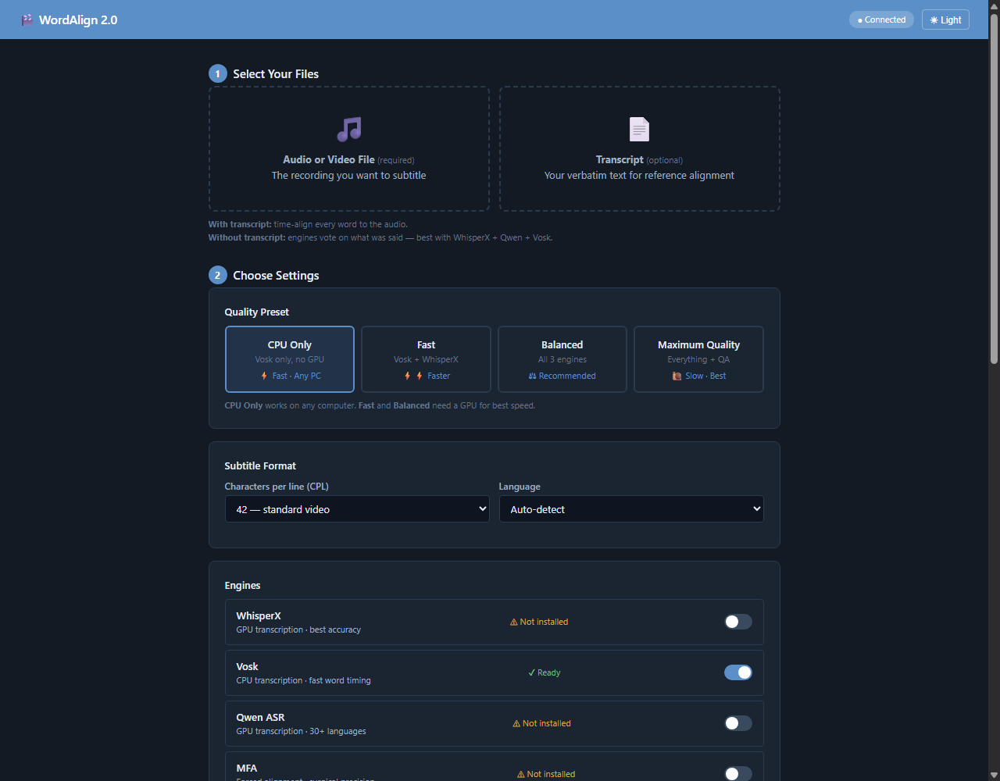
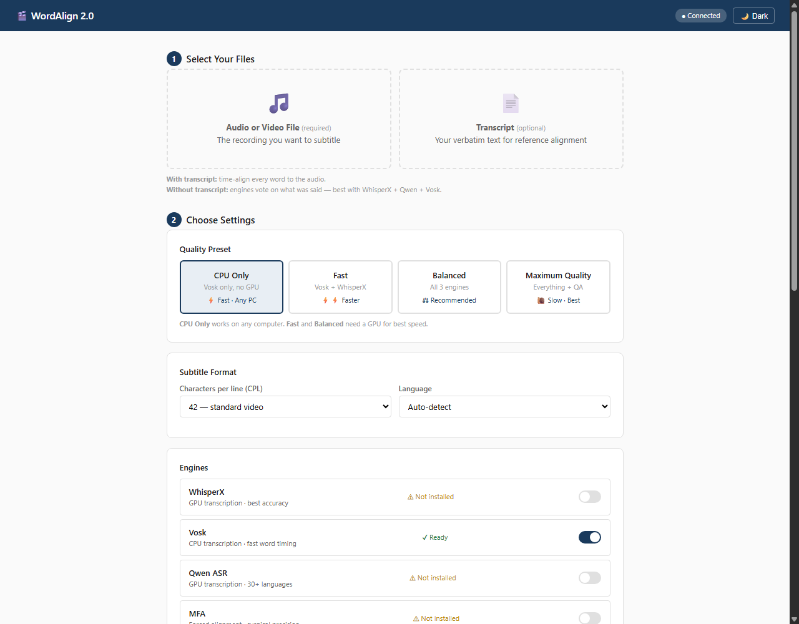

# WordAlign 2.0

**Speech-to-subtitle alignment & transcription, for humans and machines.**

WordAlign turns any audio or video file into precisely timed subtitles — word-level and sentence-level **SRT, WebVTT or ASS**, plus a clean transcript. It combines multiple ASR engines (Vosk, WhisperX, Qwen ASR) with forced alignment (MFA), lays cues out to your character and line limits, can label speakers, restore punctuation and capitalization, and flags anything suspicious for review.

**v2.0 is a full rewrite:** a modular plugin engine, a Model Manager that finds your local models (no forced downloads), a built-in **web GUI** (dark mode by default), a Smart Transcript Review system, and one-click portable builds for Windows — no Python or terminal required.

---

## 🖥️ Screenshots

The GUI runs in your browser (auto-opened), with **dark mode by default** — toggle to light any time with the header button (or `?light=1` in the URL).

| Dark mode (default) | Light mode |
|---|---|
|  |  |

---

## ✨ What's New in 2.0

- **🖥️ Web GUI** — drag-and-drop files, pick a quality preset, click Run. Real progress bar, live log, cancel button. Opens in your default browser; no install beyond the app itself.
- **🌙 Dark mode** — default theme, one-click toggle.
- **🧠 Smart Transcript Review** — restores **punctuation and capitalization** (a local LLM such as Gemma via llama.cpp, with a rule-based fallback; a cue the LLM rewords is never accepted), and an optional QA pass flags repeated phrases, timing anomalies, long untimed stretches and low-agreement words.
- **🎬 SRT, WebVTT and ASS** — `--formats srt,vtt,ass`; ASS keeps the job's own line layout for burn-in.
- **🗣️ Speaker labels** — `--diarize` (pyannote.audio): cues never mix speakers; names appear as VTT voices, the ASS Name field, an SRT prefix and transcript paragraphs.
- **📁 Batch mode** — `--batch FOLDER` subtitles a whole folder, pairing `talk.mp4` with `talk.txt`/`talk.srt`, with a JSON report.
- **🧩 Plugin engine architecture** — adding a new ASR/alignment engine is a drop-in plugin. No core edits, no CLI edits, no GUI edits.
- **📦 Model Manager** — auto-detects your installed models (Vosk, Whisper, Hugging Face cache, MFA) and every model path is configurable. No surprise downloads.
- **🌍 MFA for 65+ languages** — mapped to Montreal Forced Aligner pretrained models for surgical gap-filling; skipped (never faked with English) for a language it has no model for.
- **🔁 Job queue & recovery** — GUI jobs run one at a time (GPU engines never load two models at once), and jobs interrupted by a shutdown are marked as such and can be re-run from the stage cache.
- **📊 Manifest & cache** — fingerprint-based stage caching (re-runs skip the engines), a JSON job manifest with timing-source statistics, SQLite job history.

---

## 🚀 Quick Start

### Windows — for non-technical users (no Python, no terminal)

1. Download the latest **`WordAlign-portable.zip`** from the [Releases page](https://github.com/ghalymt/word-align/releases).
2. Unzip anywhere (e.g. `C:\WordAlign`).
3. Put the models you want in the `models\` folder next to `WordAlign.exe` — `MODELS.txt` in the ZIP lists where each kind goes. (The ZIP holds the app only; models are hundreds of MB to several GB each.)
4. Double-click **`Launch WordAlign.vbs`** — the local server starts and a browser tab opens with the GUI.
5. Drop in your audio/video, pick settings, hit **Run**.

> Vosk models are the out-of-the-box engine. If you already have Vosk models installed (e.g. under `D:\Subtitle edit\Vosk`), set the folder once in the GUI's **Model Paths** panel — no downloads needed. The same applies to Whisper, Qwen and MFA models.

### Windows — from source (Python 3.10+)

```bat
git clone https://github.com/ghalymt/word-align.git
cd word-align
py -m venv .venv
.venv\Scripts\activate
pip install -e .
# Optional GPU backends: pip install -e ".[asr,qwen]"
wordalign --gui            :: or just: wordalign
:: CLI:
wordalign --engines vosk -l en input.mp4 -o out
```

### Linux / macOS — from source (Python 3.10+)

```bash
git clone https://github.com/ghalymt/word-align.git
cd word-align
python3 -m venv .venv
source .venv/bin/activate
pip install -e .
# Optional GPU backends: pip install -e ".[asr,qwen]"
wordalign --gui            # opens the browser GUI
# CLI:
wordalign --engines vosk -l en input.mp4 -o out
```

> Linux/macOS packages (AppImage, .deb, Homebrew) are planned — see [Releases](https://github.com/ghalymt/word-align/releases) for current assets. The Python source install works everywhere today.

---

## 🧑‍💻 CLI Reference

`wordalign --help` prints every option. The main ones:

```text
wordalign [MEDIA] [OPTIONS]          (no arguments: start the GUI)

Input & mode:
  -t, --transcript FILE    Verbatim transcript (.txt, or .srt to keep its cue
                           boundaries). Omit it for transcript-free ensemble mode.
  --srt FILE               Rough SRT used as an extra timing source
  -l, --language CODE      ISO 639-1 code, e.g. en, ar, fr (default: auto-detect)
  --batch FOLDER           Process every media file in FOLDER (see Batch mode)
  -o, --out DIR            Output directory (default: next to the media)

Engines:
  --engines LIST           whisperx,qwen,vosk,mfa (default: whisperx,qwen,vosk + MFA)
  --no-vosk / --no-qwen / --no-whisperx / --no-mfa / --use-mfa
                           Per-engine switches; they win over --engines and --profile
  --profile NAME           cpu_only, fast, balanced, maximum_quality (or a .json file)
  --legacy-ensemble        Old all-voters consensus instead of the primary-transcript flow
  --device cuda|cpu        Force the compute device

Subtitle layout & output:
  --cpl N                  Max characters per line (42 video, 32 vertical; default 42)
  --max-lines N            Max lines per cue (default 2)
  --max-duration-ms MS     Max on-screen time per cue (default 7000)
  --min-cue-ms MS          Min on-screen time per cue (default 700)
  --formats LIST           Sentence-level files: srt, vtt, ass (default: srt)
  --doc none|txt|docx|both Ensemble-mode transcript document (default: txt)
  --diarize [--speakers N] Label speakers (needs pyannote.audio + HF_TOKEN)
  --tags                   Experimental audio-event tags ([music], [laughs], ...)

Review:
  --punctuation            Restore punctuation & capitalization (ensemble mode)
  --qa                     Deterministic quality checks (repetition, timing, gaps)
  --llm-engine PATH        llama.cpp folder or llama-cli executable
  --llm-model PATH         Main GGUF model
  --llm-mtp-model PATH     MTP draft GGUF (multi-token prediction); --no-mtp disables

Model locations (each also has an environment variable, see below):
  --vosk-models DIR  --whisper-models DIR  --qwen-models DIR  --hf-cache DIR
  --mfa-models DIR   --mfa PATH (mfa executable or conda env)  --qwen-python PATH

GUI:
  --gui [--port N]         Start the web GUI (default port 5575)
```

Examples:

```bash
# Vosk only (CPU, no GPU required), English, punctuation restored
wordalign --engines vosk -l en --punctuation video.mp4

# Maximum quality, with WebVTT and ASS as well as SRT
wordalign --profile maximum_quality --qa --formats srt,vtt,ass video.mp4

# Align a human transcript, vertical-video layout (32 CPL, up to 3 lines)
wordalign interview.mp4 -t interview.txt --cpl 32 --max-lines 3

# Use your locally installed models (no downloads)
wordalign --vosk-models "D:\Subtitle edit\Vosk" --engines vosk -l en video.mp4
```

### Modes

- **Reference mode** (`-t transcript`) — your transcript's words are kept exactly; the engines only supply timings, in a waterfall (Vosk → rough SRT → Qwen → WhisperX → MFA → interpolation) where each stage fills the words the earlier ones missed. An `.srt` transcript keeps its own cue boundaries (`[tags]` are skipped).
- **Ensemble mode** (no transcript) — the best available engine (WhisperX, else Qwen, else Vosk) produces the transcript and first timings; Vosk and Qwen then **refine** those timings for the words they recognise (never moving a word by more than a second), and MFA fills any gaps. `--legacy-ensemble` switches to the older consensus vote across all engines.

### Batch mode

```bash
wordalign --batch D:\Lectures --recursive --formats srt,vtt
```

Every media file in the folder is processed with the same options. `talk.mp4` is paired with `talk.txt` (or `talk.srt`) when present, otherwise it runs in ensemble mode. One failure does not stop the batch: a summary is printed, `wordalign_batch_report.json` is written next to the outputs, and the exit code is non-zero if anything failed. `--skip-existing` resumes an interrupted batch.

### Speaker labels

`--diarize` uses [pyannote.audio](https://github.com/pyannote/pyannote-audio) (`pip install pyannote.audio`). Its model is gated: accept the terms of `pyannote/speaker-diarization-3.1` on Hugging Face once and set `HF_TOKEN`. Cues never mix two speakers; speakers appear as `<v Speaker 2>` in WebVTT, in the ASS Name field, as a `Speaker 2:` prefix in SRT whenever the speaker changes, and as paragraphs in the transcript. Without pyannote the stage is skipped with a warning.

---

## 🧠 Smart Transcript Review

Raw ASR output is lowercase and punctuation-free, which is hard to read as subtitles. In ensemble mode `--punctuation` fixes this:

1. **Punctuation & capitalization** — a local LLM (e.g. Gemma via llama.cpp) restores each cue in batches, and a cue whose *words* the model changed is rejected and handled by the rule-based restorer instead, so subtitle text never drifts from what was said. The rule-based restorer (capitalization, terminal periods, lowercase *i*) also works on its own when no LLM is configured.
2. **Quality checks** (`--qa`) — deterministic flags for repeated phrases, implausible word durations, overlapping timestamps, long runs of interpolated (untimed) words and low ensemble agreement. Issues are saved with the job and shown in the GUI.

```bash
wordalign --punctuation \
  --llm-engine "D:\llama.cpp" \
  --llm-model "F:\Models\gemma-4-12B-it-qat-UD-Q4_K_XL.gguf" \
  --llm-mtp-model "F:\Models\mtp-gemma-4-12B-it.gguf" \
  --engines vosk -l en video.mp4
```

Without these flags WordAlign looks in `models\llama.cpp\` and `models\llm\` next to the app. Environment variables: `WORDALIGN_LLM_ENGINE`, `WORDALIGN_LLM_MODEL`, `WORDALIGN_LLM_MTP_MODEL`.

---

## 🌍 Languages & Models

WordAlign supports **65+ languages** across its engines:

- **Vosk** — en, ar, zh, fr, de, es, pt, it, nl, ru, ja, fa, tr, sv, ca, uk, tl, vi, hi, hr, sr, bs, th, pl + more (depends on which Vosk models you have installed).
- **WhisperX / Qwen ASR** — any language supported by Whisper / Qwen3-ASR.
- **MFA (forced alignment)** — mapped pretrained models for 65+ languages (English ARPA, Arabic, Mandarin, French, German, Spanish, Portuguese, Italian, Dutch, Russian, Japanese, Korean, Persian, Turkish, Swedish, Catalan, Ukrainian, Vietnamese, Hindi, Croatian, Serbian, Bosnian, Thai, Polish, Czech, Slovak, Greek, Romanian, Hungarian, Hebrew, Finnish, Danish, Norwegian, Indonesian, Malay, Tagalog, Bengali, Urdu, Tamil, Telugu, Nepali, Sinhala, Khmer, Lao, Burmese, Armenian, Georgian, Bulgarian, Macedonian, Slovenian, Albanian, Galician, Basque, Swahili, Amharic, Zulu, Xhosa, Yoruba, Igbo, Hausa, Cebuano, and more). MFA is skipped (with a warning) for a language without a pretrained MFA model, or when that language's acoustic/G2P model is not installed; it never falls back to another language's model. MFA is on by default in the CLI and in the GUI's Balanced and Maximum Quality presets, and only runs when it is installed and has a model for the language — use `--no-mfa` (or untick it) to turn it off.

### Model paths — all configurable

WordAlign is portable: by default every model lives in the `models\` folder next to the app (or the repo root), and nothing is downloaded behind your back. Every location can be overridden with a CLI flag, an environment variable, or the GUI's Model Paths panel:

| Models | Default | CLI flag | Environment variable |
|---|---|---|---|
| Vosk | `models/vosk/` | `--vosk-models DIR` | `WORDALIGN_VOSK_MODELS` |
| Whisper / WhisperX | `models/whisper/` | `--whisper-models DIR` | `WORDALIGN_WHISPER_MODELS` |
| Hugging Face cache | `models/huggingface/` | `--hf-cache DIR` | `WORDALIGN_HF_CACHE` |
| Qwen | Hugging Face cache | `--qwen-models DIR` | `WORDALIGN_QWEN_MODELS` |
| MFA | `models/mfa/pretrained_models/` | `--mfa-models DIR` | `WORDALIGN_MFA_MODELS` |
| LLM (punctuation) | `models/llama.cpp/`, `models/llm/` | `--llm-engine`, `--llm-model` | `WORDALIGN_LLM_ENGINE`, `WORDALIGN_LLM_MODEL` |

The `/api/model-paths` endpoint (and the GUI panel) shows exactly what was resolved on your machine.

### Other environment variables

| Variable | Effect |
|---|---|
| `WORDALIGN_WHISPERX_PYTHON`, `WORDALIGN_QWEN_PYTHON` | Python of the separate venv that runs WhisperX / Qwen |
| `WORDALIGN_MFA` | `mfa` executable or its conda env |
| `WORDALIGN_FFMPEG`, `WORDALIGN_FFPROBE` | ffmpeg / ffprobe to use |
| `WORDALIGN_CACHE` | Stage-cache folder (default `.wordalign_cache/` in the project) |
| `WORDALIGN_PORT` | GUI port when started without arguments |
| `WORDALIGN_MAX_CONCURRENT_JOBS` | GUI jobs run at the same time (default 1) |
| `WORDALIGN_GPU_SLOTS` | GPU engines loaded at the same time (default 1) |
| `WORDALIGN_ALLOWED_HOSTS` | Extra host names the GUI server answers to (LAN setups) |
| `HF_TOKEN`, `WORDALIGN_DIARIZATION_MODEL` | Access token / pipeline for `--diarize` |

### GUI server security

The GUI server listens on `127.0.0.1` only and refuses requests that come from other websites open in your browser (cross-origin POSTs, foreign `Host` headers). Scripts and `curl` on the same machine can still use the API.

---

## 🏗️ Architecture

```
word-align/
├── launcher.py            # Entry point: no args = GUI, args = CLI
├── build.spec / build.py  # PyInstaller portable build
├── wordalign/
│   ├── cli_v2.py          # CLI (2.0) — thin layer over PipelineRunner
│   ├── batch.py           # --batch folder processing
│   ├── subtitle_formats.py # WebVTT / ASS writers
│   ├── diarize.py         # speaker labels (pyannote.audio)
│   ├── core/
│   │   ├── pipeline.py    # PipelineRunner — the single pipeline used by CLI + GUI
│   │   ├── types.py, config.py, events.py
│   │   ├── cache.py       # fingerprint-based job caching
│   │   ├── database.py    # SQLite job history
│   │   ├── fingerprint.py # audio fingerprinting
│   │   ├── manifest.py    # job manifests
│   │   ├── recovery.py    # crash recovery / checkpoints
│   │   ├── gpu_scheduler.py # one GPU model at a time across jobs
│   │   └── converters.py
│   ├── engines/           # Engine adapters (plugin architecture)
│   │   ├── vosk_engine.py, whisperx_engine.py, qwen_engine.py
│   │   ├── mfa_engine.py  # 65+ language map, surgical gap alignment
│   │   ├── yamnet_engine.py, nemo_engine.py   # nemo = legacy
│   │   └── adapters/      # runtime adapters (in_process / subprocess / external)
│   ├── plugins/           # Plugin registry, protocol, manifests, capabilities
│   ├── models/            # Model manager, catalog, validator, paths, downloader
│   ├── qa/                # Smart Transcript Review
│   │   ├── punctuation.py # LLM + rule-based punctuation/capitalization
│   │   ├── realignment.py, deterministic.py, engine.py, codeswitch.py
│   │   └── providers/     # local transformers model, OpenAI-compatible endpoint
│   ├── runtimes/          # Runtime detection (python, conda, external)
│   ├── profiles/          # Quality presets (cpu_only, fast, balanced, maximum_quality)
│   ├── gui/               # Web GUI (app.html, server.py, waveform.py)
│   └── benchmark.py       # Benchmark suite
├── tests/                 # unit, integration, golden-file and real-audio accuracy tests
└── docs/                  # architecture.md, developer.md, user_guide.md
```

**Key design rule:** the CLI and the GUI both call the same `PipelineRunner`. There is no separate pipeline for the GUI — what you see in the browser is exactly what the CLI does.

**Plugins:** the registry and adapters define the plugin contract for in-process, subprocess, and external engines. The current runner uses the built-in engine adapters for its production waterfall; new adapters can be registered and exposed through the API before their operations are promoted into the waterfall.

---

## 🧪 Tests

```bash
pip install -e ".[dev]"
python -m pytest tests/ -q
```

CI runs the suite on Linux and Windows (Python 3.10 and 3.12) for every pull request. Besides unit and integration tests:

- **Golden files** (`tests/golden/`) — recorded engine output goes through the real pipeline and every subtitle file must match the checked-in result byte for byte. After an intentional output change: `WORDALIGN_REGEN_GOLDEN=1 python -m pytest tests/test_golden.py`, then review the diff.
- **Real-audio accuracy** — a speech clip with known word boundaries is aligned by a real Vosk model and the timing error must stay within bounds. CI downloads the model; locally set `WORDALIGN_TEST_VOSK_MODEL` to an unpacked Vosk model to run it.

---

## 📦 Building the Portable Package (Windows)
```powershell
# from the repo root, with Python + PyInstaller installed
python build.py --zip
# output: dist\WordAlign\WordAlign.exe, Launch WordAlign.vbs
#         and dist\WordAlign-portable.zip (app only, plus MODELS.txt)
```

`build.py` produces a Windows onedir bundle and links (or, with `--copy-models`, copies) the
local `models/` tree into it for testing. The release ZIP leaves `models/` out — it is tens of
GB, over GitHub's 2 GiB asset limit — and includes `MODELS.txt` instead; `--zip-with-models`
builds a full offline bundle for private distribution. The heavy Qwen and WhisperX
virtual environments are staged separately with `powershell -File scripts\build_backends.ps1`
(or `build_windows.ps1 -BuildBackends`); MFA remains an optional external binary.
The resulting `Launch WordAlign.vbs` starts the local GUI without requiring Python.

---

## 📄 License & Notes

- MIT License — see [LICENSE](LICENSE).
- **NeMo (Parakeet/Canary)**: kept as *legacy* engines in the source (via `nemo_engine.py` / `nemo_adapter.py`) but **not** installed or recommended in 2.0 — the modern default ensemble is **WhisperX + Qwen + Vosk**. If you have NeMo installed, you can still opt in via `--engines parakeet,canary`; otherwise ignore it.
- MFA model downloads happen through MFA's own tooling (`mfa model download acoustic <name>`) — WordAlign only needs the `mfa` executable and the model directories configured above.

---

## 🤝 Contributing

See [docs/developer.md](docs/developer.md) for the plugin API, [docs/architecture.md](docs/architecture.md) for internals, and [docs/user_guide.md](docs/user_guide.md) for detailed usage.
